# AshkaBook — .NET E-Commerce

A full-stack bookstore built with **ASP.NET Core 10** (layered architecture) and **React 19 + TypeScript**.
JWT authentication with role-based access, a database-backed cart, tiered volume pricing, Stripe Checkout with
webhook-verified payments, and an admin panel with LINQ-powered analytics.

<p align="left">
  
  
  
  
  
  
  
  
</p>

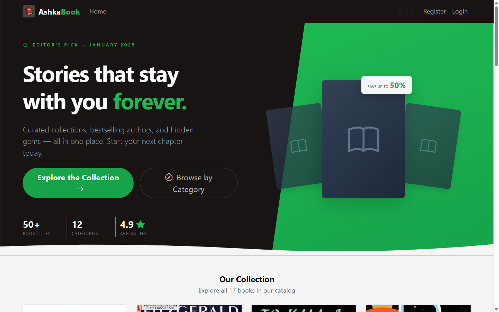

---

## Table of Contents

- [Features](#features)
- [Tech Stack](#tech-stack)
- [Architecture](#architecture)
- [Screenshots](#screenshots)
- [Getting Started](#getting-started)
- [Configuration](#configuration)
- [API Reference](#api-reference)
- [Payment Flow](#payment-flow)
- [Testing](#testing)
- [Project Structure](#project-structure)
- [Project Status](#project-status)

---

## Features

### Storefront
- Book catalog with pagination, category filtering, and title/author search
- Product detail pages showing **tiered volume pricing** (1–50 / 51–100 / 100+ units)
- Persistent, database-backed cart tied to the user account — the same cart follows you across devices
- Stripe Checkout: the customer is redirected to Stripe's hosted payment page, so card data never touches this server, then returns to a confirmation page

### Identity & Authorization
- ASP.NET Core Identity with JWT bearer tokens
- Two roles — `Admin` and `Customer` — seeded on first startup along with an initial admin account
- Public read endpoints; write endpoints gated by `[Authorize(Roles = "Admin")]`
- The cart resolves the user from the JWT's `NameIdentifier` claim, never from a client-supplied `userId`

### Admin Panel
- Dashboard with revenue totals, a 12-month revenue trend, order-status breakdown, and products-per-category — all computed with LINQ `GroupBy`/`Sum`/`Count` aggregations
- Product and category CRUD
- Order list with status filtering and manual status transitions (Pending → Paid → Processing → Shipped → Cancelled)
- User list

### Cross-Cutting
- Global exception handler returning RFC 9110 `ProblemDetails` — no stack traces leak to clients
- DataAnnotations validation on every inbound DTO
- CORS policy driven by configuration
- OpenAPI document + **Scalar** interactive API reference with JWT auth wired in
- All secrets (connection string, JWT signing key, Stripe keys, seed admin password) live in `dotnet user-secrets` — `appsettings.json` ships empty

---

## Tech Stack

| Layer | Technology |
|---|---|
| Runtime | .NET 10 |
| API | ASP.NET Core Web API, controller-based |
| ORM | EF Core 10 (Code-First + migrations) |
| Database | SQL Server 2022 in Docker |
| Auth | ASP.NET Core Identity + JWT Bearer |
| Payments | Stripe.net (Checkout Session + webhook) |
| API docs | `Microsoft.AspNetCore.OpenApi` + `Scalar.AspNetCore` |
| Frontend | React 19, TypeScript, Vite 8, React Router 7, Axios |
| Testing | xUnit, Moq, `WebApplicationFactory` |

---

## Architecture

The backend is split into four projects with a strictly one-directional dependency chain. Because `ECommerce.Domain`
holds no reference to `ECommerce.Infrastructure`, the compiler — not a code-review convention — is what prevents
domain logic from reaching for `DbContext`.

```
API  →  Infrastructure  →  Application  →  Domain
```

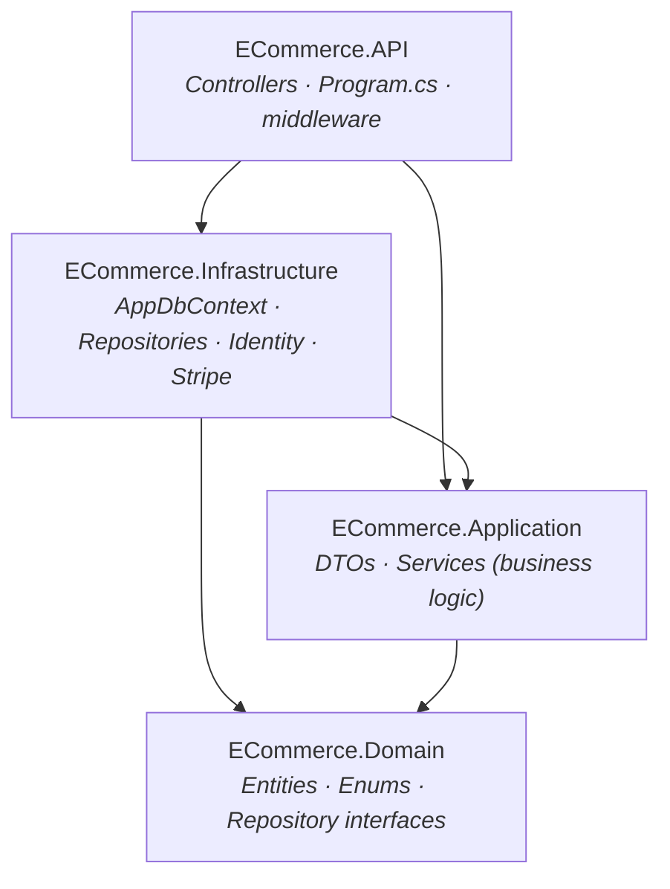

| Project | Responsibility | Depends on |
|---|---|---|
| **Domain** | Entities, enums, repository + payment interfaces. Zero NuGet dependencies — pure business objects. | — |
| **Application** | DTOs, service interfaces, business logic, manual entity↔DTO mapping. | Domain |
| **Infrastructure** | `AppDbContext`, migrations, repository implementations, Identity seeding, Stripe integration. | Application, Domain |
| **API** | Controllers, DI registration, JWT/CORS setup, exception handling, OpenAPI. | Infrastructure, Application |

**Design decisions worth calling out**

- `ApplicationUser` lives in **Infrastructure**, not Domain — it derives from Identity's `IdentityUser`, a NuGet type
  that would break Domain's zero-dependency rule. `Order` therefore stores a plain `string UserId` instead of a
  navigation property.
- `OrderItem` snapshots both the product title and the unit price at purchase time. If a product is later renamed,
  repriced, or removed, order history stays intact. `CartItem` deliberately does **not** snapshot — a cart reflects
  the present, so it reads live prices from `Product`.
- `OrderItem → Product` and `Category → Products` use `DeleteBehavior.Restrict` so deleting a product can never
  erase order history; `Cart → CartItem → Product` uses `Cascade`, since a cart is transient state.
- All money fields are `decimal` with `HavePrecision(18,2)`, never `double`/`float`.
- A unique index on `(CartId, ProductId)` enforces one row per product per cart at the database level, backing up
  the service-layer "increment quantity if already present" logic.

---

## Screenshots

### Storefront

| Catalog | Product detail |
|---|---|
|  | 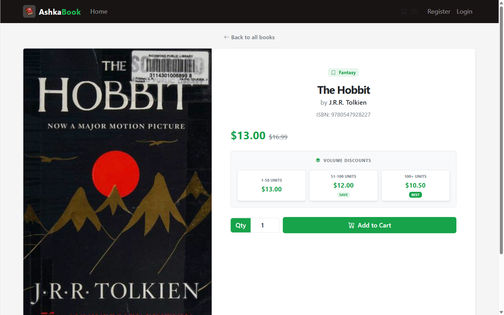 |

**Cart & checkout** — line totals, live order summary, and shipping details collected before the Stripe redirect.

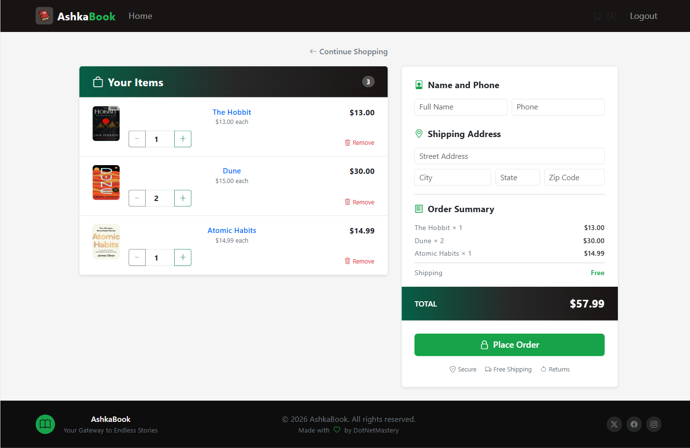

| Login | Post-payment landing |
|---|---|
| 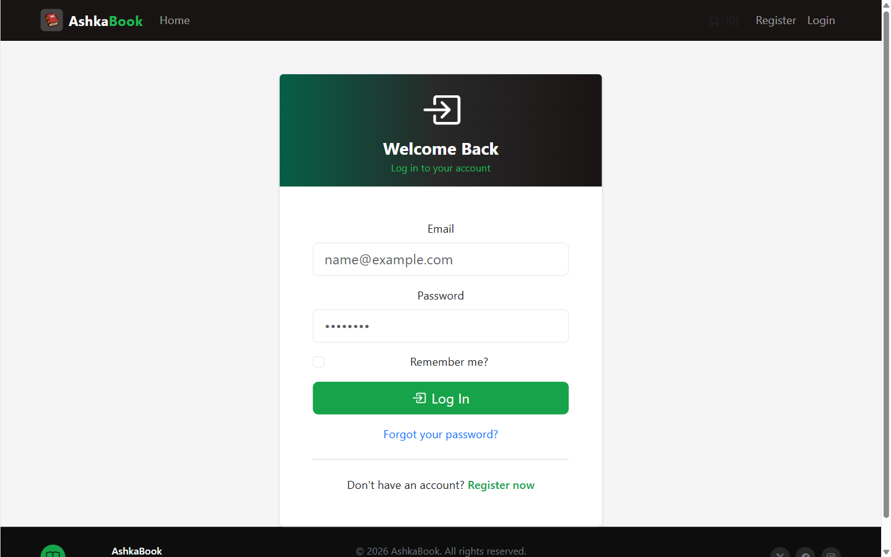 | 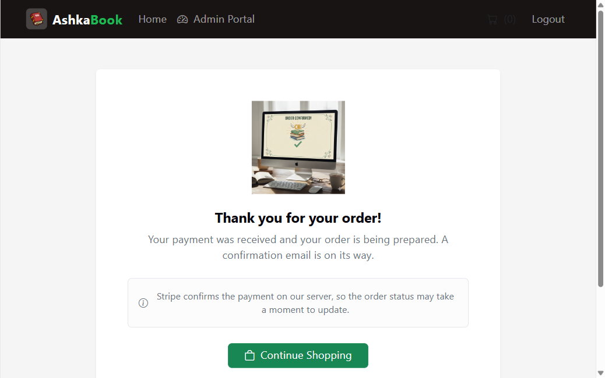 |

The login page issues a JWT that an Axios request interceptor attaches to every subsequent call. The
`/order-success` page Stripe redirects to is **purely informational and makes no API call** — reaching that URL
proves nothing, since anyone can type it. Only the webhook marks an order `Paid`.

### Admin Panel

**Dashboard** — every figure below is a LINQ aggregation over the live database.

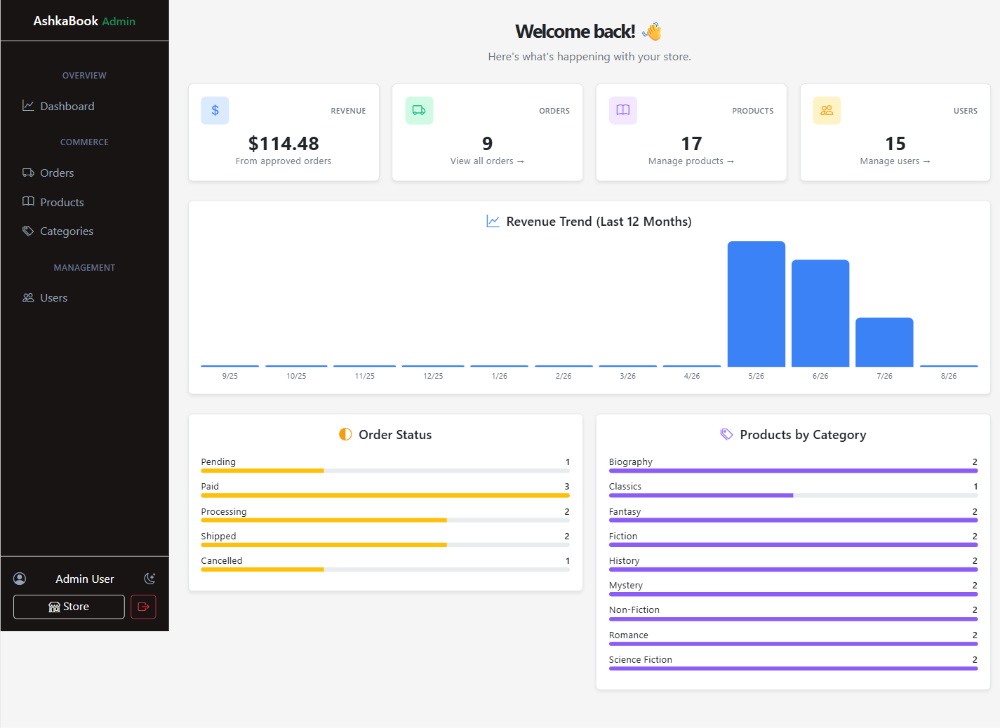

| Products | Orders |
|---|---|
| 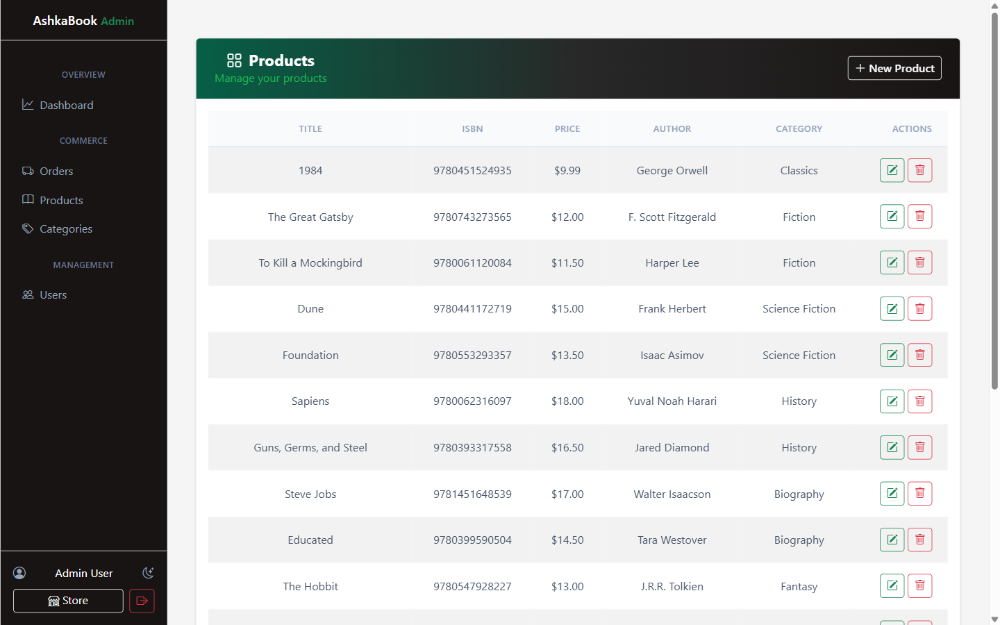 | 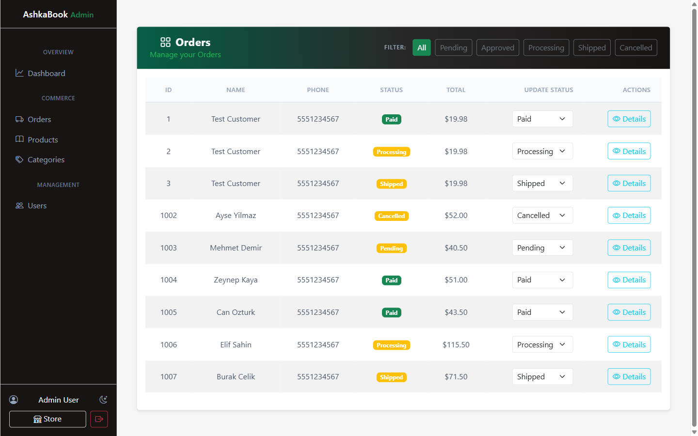 |

**Categories**

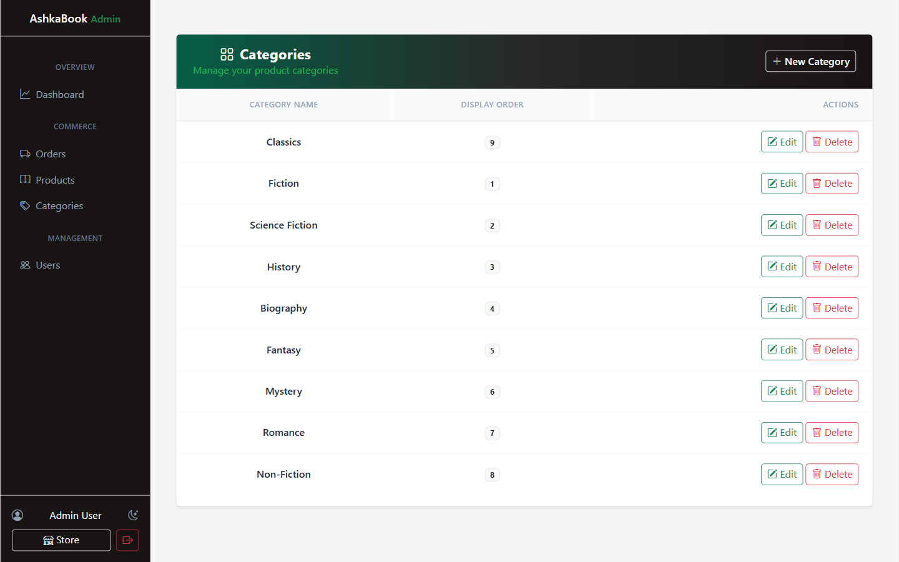

---

## Getting Started

### Prerequisites

- [.NET SDK 10.0](https://dotnet.microsoft.com/download)
- [Node.js 20+](https://nodejs.org/)
- [Docker](https://www.docker.com/) (for SQL Server)
- `dotnet-ef` CLI: `dotnet tool install --global dotnet-ef`
- A [Stripe](https://stripe.com/) account — **test mode keys only**

### 1. Start SQL Server

```bash
docker run -e "ACCEPT_EULA=Y" -e "MSSQL_SA_PASSWORD=<your-strong-password>" \
  -p 1433:1433 --name ecommerce-sql -d mcr.microsoft.com/mssql/server:2022-latest
```

> LocalDB works too, but it binds to a dynamic named pipe rather than a TCP port, which trips up the VS Code
> `mssql` extension. The container listens on a real port (1433) and behaves more like production.

### 2. Configure secrets

Nothing sensitive is committed — populate user secrets locally:

```bash
cd backend

dotnet user-secrets set "ConnectionStrings:DefaultConnection" \
  "Server=localhost,1433;Database=ECommerceDb;User Id=sa;Password=<your-strong-password>;TrustServerCertificate=True" \
  --project src/ECommerce.API

dotnet user-secrets set "Jwt:SigningKey" "<a-long-random-value>" --project src/ECommerce.API
dotnet user-secrets set "Jwt:Issuer"     "ECommerce.API"        --project src/ECommerce.API
dotnet user-secrets set "Jwt:Audience"   "ECommerce.Client"     --project src/ECommerce.API

dotnet user-secrets set "Stripe:SecretKey"     "sk_test_..." --project src/ECommerce.API
dotnet user-secrets set "Stripe:WebhookSecret" "whsec_..."   --project src/ECommerce.API

dotnet user-secrets set "SeedAdmin:Email"    "admin@example.com" --project src/ECommerce.API
dotnet user-secrets set "SeedAdmin:Password" "<admin-password>"  --project src/ECommerce.API
```

### 3. Apply migrations

```bash
cd backend
dotnet ef database update --project src/ECommerce.Infrastructure --startup-project src/ECommerce.API
```

On first run the app seeds the `Admin` and `Customer` roles plus the admin account from `SeedAdmin:*`.

### 4. Run the backend

```bash
cd backend
dotnet run --project src/ECommerce.API --launch-profile http
```

- API → `http://localhost:5003`
- Scalar docs → `http://localhost:5003/scalar/v1`

### 5. Run the frontend

```bash
cd frontend
npm install
```

Create `frontend/.env`:

```
VITE_API_BASE_URL=http://localhost:5003
```

```bash
npm run dev
```

App → `http://localhost:5173`

### 6. Forward Stripe webhooks (optional, for the payment flow)

The Stripe CLI is installed on Windows via [Scoop](https://scoop.sh/) — it is not in `winget`:

```bash
scoop bucket add stripe https://github.com/stripe/scoop-stripe-cli.git
scoop install stripe

stripe listen --forward-to http://localhost:5003/api/payments/webhook
```

Save the printed `whsec_...` value as `Stripe:WebhookSecret`.

---

## Configuration

`appsettings.json` holds only non-sensitive values; everything else comes from user secrets or environment variables.

| Key | Source | Purpose |
|---|---|---|
| `ConnectionStrings:DefaultConnection` | user-secrets | SQL Server connection |
| `Jwt:SigningKey` / `Jwt:Issuer` / `Jwt:Audience` | user-secrets | Token signing and validation |
| `Stripe:SecretKey` | user-secrets | Stripe API access |
| `Stripe:WebhookSecret` | user-secrets | Webhook HMAC verification |
| `SeedAdmin:Email` / `SeedAdmin:Password` | user-secrets | Initial admin account |
| `Cors:AllowedOrigins` | `appsettings.json` | Allowed frontend origins |
| `Frontend:SuccessUrl` / `Frontend:CancelUrl` | `appsettings.json` | Stripe redirect targets — **read from config, never from the client**, to avoid open redirects |
| `VITE_API_BASE_URL` | `frontend/.env` | API base URL for Axios |

---

## API Reference

Base URL: `http://localhost:5003`

### Auth

| Method | Endpoint | Access | Description |
|---|---|---|---|
| `POST` | `/api/auth/register` | Public | Create an account, auto-assigned the `Customer` role |
| `POST` | `/api/auth/login` | Public | Return a JWT containing id, email, and role claims |

### Products

| Method | Endpoint | Access | Description |
|---|---|---|---|
| `GET` | `/api/products?pageNumber=&pageSize=&categoryId=` | Public | Paged list, optionally filtered by category |
| `GET` | `/api/products/search?term=` | Public | Search by title or author |
| `GET` | `/api/products/{id}` | Public | Single product |
| `POST` | `/api/products` | Admin | Create |
| `PUT` | `/api/products/{id}` | Admin | Update |
| `DELETE` | `/api/products/{id}` | Admin | Delete |

### Categories

| Method | Endpoint | Access | Description |
|---|---|---|---|
| `GET` | `/api/categories` | Public | List all |
| `GET` | `/api/categories/{id}` | Public | Single category |
| `POST` | `/api/categories` | Admin | Create |
| `PUT` | `/api/categories/{id}` | Admin | Update |
| `DELETE` | `/api/categories/{id}` | Admin | Delete (blocked while products reference it) |

### Cart

| Method | Endpoint | Access | Description |
|---|---|---|---|
| `GET` | `/api/cart` | Authenticated | Current user's cart with computed line totals |
| `POST` | `/api/cart/items` | Authenticated | Add product (increments quantity if already present) |
| `PUT` | `/api/cart/items/{productId}` | Authenticated | Update quantity (≤ 0 removes the row) |
| `DELETE` | `/api/cart/items/{productId}` | Authenticated | Remove a line |
| `DELETE` | `/api/cart` | Authenticated | Empty the cart |

### Orders & Payments

| Method | Endpoint | Access | Description |
|---|---|---|---|
| `POST` | `/api/orders/checkout` | Authenticated | Create a `Pending` order + Stripe Checkout Session, return its URL |
| `POST` | `/api/payments/webhook` | Stripe only | Signature-verified webhook; marks the order `Paid` and clears the cart |

### Admin

| Method | Endpoint | Access | Description |
|---|---|---|---|
| `GET` | `/api/admin/dashboard` | Admin | Revenue, counts, monthly trend, status + category breakdowns |
| `GET` | `/api/admin/orders?status=` | Admin | Orders, optionally filtered by status |
| `PUT` | `/api/admin/orders/{orderId}/status` | Admin | Change an order's status |
| `GET` | `/api/admin/users` | Admin | User list |

---

## Payment Flow

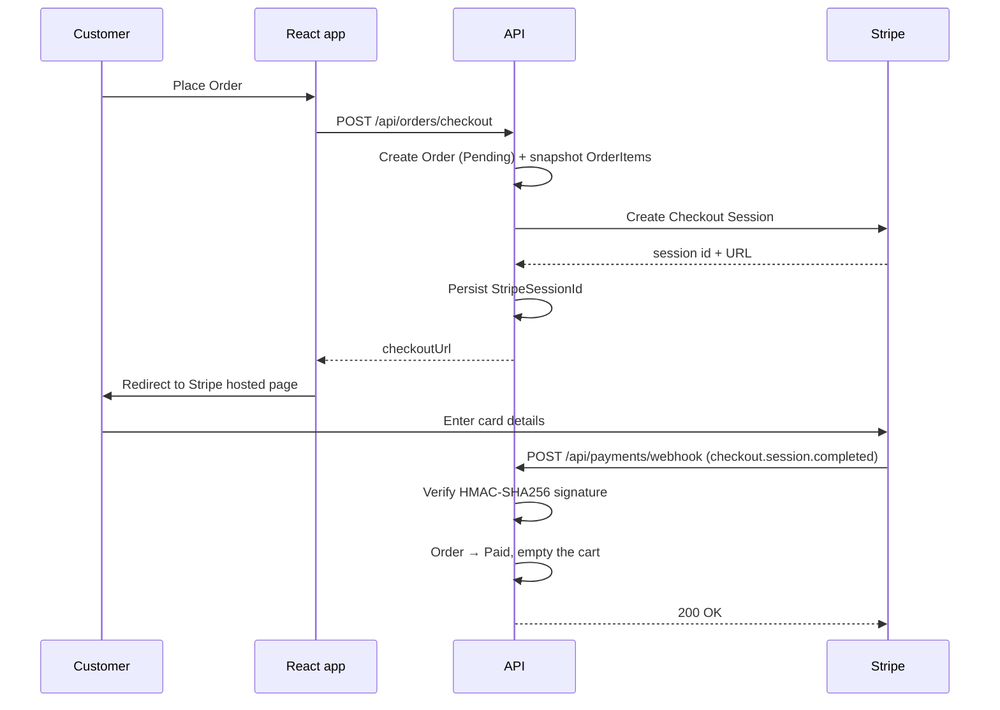

**An order is never marked `Paid` on the frontend's word.** A browser can forge that call; a webhook arrives from
Stripe's servers and carries a signature that can be verified. The handler is also idempotent — Stripe may deliver
the same event more than once, so a non-`Pending` order exits silently rather than erroring and triggering a retry
storm.

> **Note on `Stripe.net` 52.1.1.** Current Stripe API versions add a third component (`v0=`) to the
> `Stripe-Signature` header alongside the classic `t=`/`v1=` pair. `EventUtility.ConstructEvent` cannot parse the
> three-component header and rejects *every* event regardless of type. Recomputing the HMAC by hand confirmed the
> secret, algorithm, and payload were all correct — only the library's header parsing was at fault. So
> `StripePaymentService` parses `t`/`v1` itself, does a constant-time comparison, and reads the event type and
> session id straight from the raw JSON.

---

## Testing

```bash
cd backend
dotnet test
```

14 tests covering:

| Suite | Type | Covers |
|---|---|---|
| `OrderServiceTests` | Unit (Moq) | Missing order, idempotent re-processing of a paid order, status-update happy path |
| `ProductTests` | Unit (`[Theory]`) | `GetUnitPrice` tier boundaries at 50 / 51 / 100 / 101 units |
| `CategoriesControllerTests` | Integration | Public endpoint reachability |
| `AuthControllerTests` | Integration | Register, login + authorized request, 403 on wrong role, 401 without a token |

Integration tests use `WebApplicationFactory<Program>` against the real Docker SQL Server rather than an in-memory
provider — a deliberate simplicity trade-off. Each run generates unique data with `Guid.NewGuid()`. **Tests fail
with connection errors when Docker is not running; that is expected.**

The Stripe webhook path is verified manually with `stripe trigger checkout.session.completed`.

---

## Project Structure

```
.NET e-commerce/
├── backend/
│   ├── ECommerce.slnx
│   ├── src/
│   │   ├── ECommerce.Domain/           # Entities, Enums, Interfaces
│   │   ├── ECommerce.Application/      # DTOs, Services
│   │   ├── ECommerce.Infrastructure/   # Persistence, Repositories, Identity, Payments
│   │   └── ECommerce.API/              # Controllers, Program.cs, ExceptionHandling
│   └── tests/
│       └── ECommerce.Tests/            # xUnit unit + integration tests
├── frontend/
│   ├── src/
│   │   ├── api/            # Axios instance + JWT interceptor
│   │   ├── components/     # Layouts, RequireAdmin route guard
│   │   ├── pages/          # customer/ (incl. OrderSuccess), admin/, identity/
│   │   ├── types/          # Shared TypeScript models
│   │   └── utils/          # auth helpers, error formatting
│   └── public/
└── docs/images/            # Screenshots used in this README
```

`backend/src/ECommerce.API/ECommerce.API.http` contains ready-to-run REST Client requests that chain the login
token into subsequent calls via `{{login.response.body.$.token}}`.

---

## Project Status

Built phase by phase as a learning project, following a local roadmap that records the reasoning behind each
decision — including the dead ends.

- ✅ **Phases 0–10 — Backend.** Environment, solution layout, domain model, EF Core + database, Identity/JWT,
  product & category CRUD, database-backed cart, orders + Stripe, admin endpoints, cross-cutting concerns, tests
- ✅ **Phase 11 — Frontend integration.** Storefront, cart, auth, the full admin panel, and the post-payment
  landing page are wired to the live API.
- 📋 **Phase 12 — Deployment.** Not started.

### Known gaps

- No refresh-token flow; JWTs expire and the user logs in again.
- Guest carts are not supported by design — the cart is keyed to `UserId`, so adding to cart requires signing in.
- Integration tests depend on a running Docker SQL Server instead of an isolated test container.
